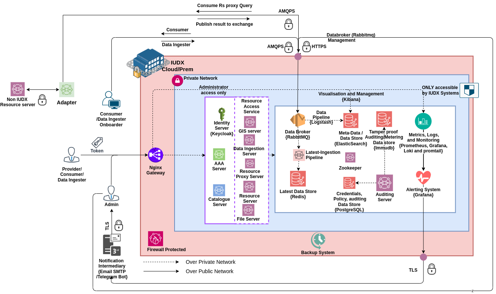
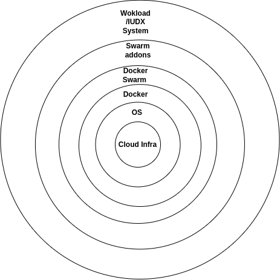
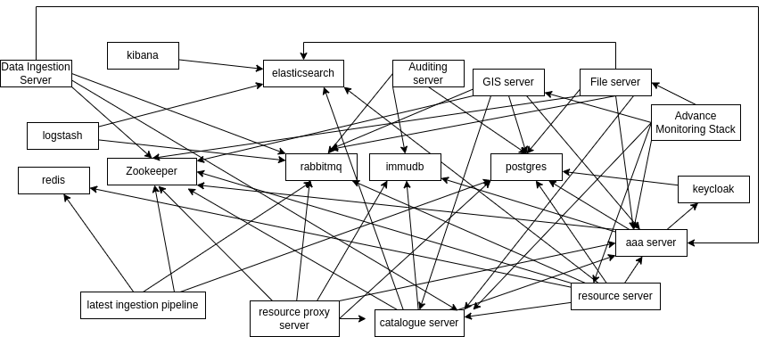

# Docker Swarm-Based Deployment
IUDX platform can be deployed in Docker Swarm using the scripts and Swarm code present in this directory and sub-directories. Each component is deployed as a single instance in Swarm. The components can be scaled manually. IUDX platform exposes endpoints through two ports - one for HTTPS traffic which it passes to Nginx and Nginx routes to appropriate service; one for Rabbitmq management and AMQPS streaming. The whole system is monitored using a monitoring stack module - Prometheus for metrics, promtail and Loki for logs, and Grafana for visualization and alerting.
The overall architecture of Swarm deployment is summarised in the below figure.  

## Features 
1. Scaling of services can be done manually by increasing the number of replica containers backing the swarm service.
2. Cloud agnostic deployment, achieved through the layered architecture of deployment and using open source tools whenever possible instead of using cloud services.
3. Cost-effective deployment, typically can be done with 4-6 nodes or a single node based on load requirements
4. It is useful for small-scale deployment/prototyping/proof-of-concept(PoC) where reliability is not critical.

## Deployment 
IUDX deployment in Docker swarm is based on layered architecture as depicted below figure: 
Layered architecture gives more flexibility in replacing different technology/software in one layer and not affecting the whole deployment. The Layered approach  also enables the deployment to be cloud agnostic.

1. First layer is cloud infrastructure, which would include bringing up the necessary infrastructure for Swarm deployment - VPC, subnet, Load balancers, IAM users, roles, Service Accounts, Virtual Machines, and Security Groups.
2. Operating System: This can be any Linux-based modern server distribution that is supported by Docker. Deployment is tested and supported on Ubuntu 20/22.04 LTS distribution.
3. Docker: Docker (docker-ce, docker-cli, build, compose plugin) needs to be installed in all the nodes to create the swarm
4. Docker Swarm: Docker swarm cluster of all nodes ( can be one or more) needs to be created with an overlay network named "overlay-net".
Installation of docker and creation of swarm with appropriate node labels is achieved using scripts at [infrastructure](./infrastructure/README.md)
5. Addons - The components which are essential for certain features on top of Swarm that IUDX deployment will actively use but not part of the IUDX platform are classified as addons. This typically includes 
    1. HTTPS API Gateway- [Nginx](./nginx/README.md)
    2. [Monitoring Stack](./monitoring-stack/README.md)

    

6. Workload/IUDX system: This is the actual deployment of IUDX components in the Docker swarm cluster. This is deployed through stack files, present in this directory.

The deployment order follows in a layered way with the innermost layer deployed first and then the next layer, until the final layer of the IUDX system. The IUDX system has a lot of components and needs to be orderly deployed, as described in next sub-section

### Dependency in IUDX systems and ordering
IUDX components depend on each other and are represented below in Directed Acyclic Graph (DAG).

From DAG, the components can be deployed as follows in 6 stages:
1. Stage 1 
    1. Immudb
    2. Rabbitmq  
    3. Postgresql
    4. Redis
    5. Zookeeper
    6. Elasticsearch (Deploy ELK together)
2. Stage 2  
    1. Logstash
    2. Kibana
    3. Keycloak
    4. Latest ingestion pipeline
    5. Auditing server
3. Stage 3
    1. AAA server
4. Stage 4 
    1. Catalogue server
5. Stage 5 
    1. Resource Server
    2. Resource Server Proxy
    3. File server
    4. GIS server
    5. Data Ingestion server
6.  Stage 6
    1. Advance Monitoring Stack
