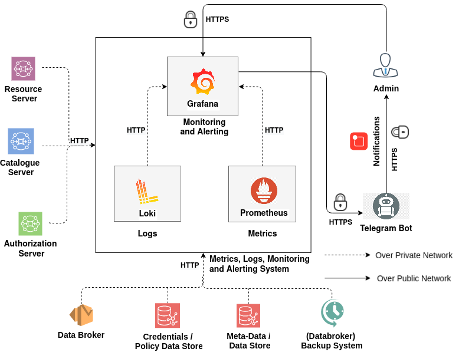

# Monitoring Stack


<p align="center">

</p>


The IUDX Monitoring stack uses Prometheus, Grafana, Micrometer, Node Exporter, Docker Daemon to capture API, System metrics. It integrates with telegram to publish alerts from Grafana based on predefined rules.  
# Monitoring-stack-Installation
## Generate secret files
1. Make a copy of sample secrets directory.
```
cp -r example-secrets/secrets .
```
2. Generate required secrets using following script:
```
./create-secrets.sh
```
3. Make sure `/tmp/metrics-targets` directory is created on the node where Prometheus is being deployed.
It needs to be recreated with every node restart as it is a temporary directory.
```
mkdir /tmp/metrics-targets
```
4. Config Telegrambot for grafana's alerts is detailed [here](https://gist.github.com/abhilashvenkatesh/50478502ccd257a28d2c441ac51a8d65). Then appropiately define the environment file  secrets/grafana-env-secret. The template is defined as follow:
 Please do not include comments and substitute appropiate correct values in the placeholders ``<placholder>``.
```
GF_SERVER_ROOT_URL=https://<grafana-domain-name>/
GF_SERVER_DOMAIN=<grafana-domain-name>
TELEGRAM_CHAT_ID=<telegram-chat-id>
TELEGRAM_BOT_TOKEN=<telegram-chat-token>
```
5. Configure servers to be monitored for certificate expiry, server up status, as targets in  blackbox-targets.yml. See below for an example.
```sh
- targets:
    - https://rs.io.test/apis
    - https://catalogue.io.test/
```
6. secrets directory after generation of secrets
```
secrets/
├── configs
│   └── blackbox-targets.yaml
├── .grafana.env
└── passwords
    ├── grafana-super-admin-passwd
    └── grafana-super-admin-username
```
## Assign node labels 
```sh
docker node update --label-add monitoring_node=true <hostname/ID>
```
## Define Appropriate values of resources

Define Appropriate values of resources -
- CPU 
- RAM 
- PID limit 
in `mon-stack.resources.yaml`  for grafana, prometheus, loki, promtail, blackbox as shown in sample resource-values file for [here](example-mon-stack.resources.yaml)

## Deploy
Deploy monitoring stack:
```sh
./install.sh
```
## Description
* Installs Vertx\_sd, Prometheus, Loki, Grafana, blackbox swarm services with replicas as one at node with "node.labels.monitoring\_node==true" .
* Promtail service installed in global mode i.e. all nodes have one promtail task running.


## Note  

1. Grafana creates super admin  when it is run for the
   first time, and the password is saved to db (i.e. grafana-volume). Subsequent
   running/restarting the docker with new admin credentials doesn't overwrite
   the password stored in Grafana db.
2. Pipeline stages might be different for each application , this can be done using [match stage](https://grafana.com/docs/loki/latest/clients/promtail/stages/match/)
3. mon-stack.yaml contains additional service vertx\_sd, which discover vertx instances from zookeeper for prometheus.
4.  The grafana is now secured through centralised nginx.
5. If you need to expose/access grafana HTTP port or have custom stack configuration( see [here](example-mon-stack.custom.yaml) for example configuration of 'mon-stack.custom.yaml' file). You can bring up as follows.
```sh
docker stack deploy -c mon-stack.yaml -c mon-stack.resources.yaml -c mon-stack.custom.yaml mon-stack
```
This is generally useful in local,dev/test environment.
                                                            
