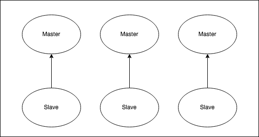

# Deployment Architecture
<p align="center">

</p>

This helm chart deploys a 6-node Redis Cluster with sharding, having 3 masters and 3 slaves.


# Installation
This installs a  Redis clustered setup.
The helm chart is based on bitnami : https://github.com/bitnami/charts/tree/master/bitnami/redis-cluster

## Generate required secrets
To generate the secrets:

```sh
./create-secrets.sh
```

```
# secrets directory after generation of secret files
secrets/
└── redis-password
```

## Define Appropriate values of resources

Define Appropriate values of resources -
- CPU of redis
- memory (RAM) of redis
- storage size and class 
- node-selector

in `resource-values.yaml` as shown in sample resource-values file for [`aws`](./example-aws-resource-values.yaml) and [`azure`](./example-azure-resource-values.yaml)

##  Run Install script

``` 
./install.sh
```
 - This will create namespace, redis password as k8s secret, redis, redis autoscaler 

## Notes:
### Rebalance the shards through redis-cli 

```
1. kubectl run --namespace redis redis-redis-cluster-client --rm --tty -i --restart='Never' \
 --env REDIS_PASSWORD=$REDIS_PASSWORD \
--image <registry-domian-name>/<repo-name>/redis-cluster-rejson:7.0.2-2.0.9 -- bash

2. redis-cli --cluster rebalance redis-redis-cluster:6379 --cluster-use-empty-masters -a $REDIS_PASSWORD

3. checking the rebalance: redis-cli --cluster check redis-redis-cluster:6379 -a $REDIS_PASSWORD

```
The adding of nodes results in creation of update job, which updates the cluster and restarts each pod one by one. The cluster will continue up while restarting pods one by one as the quorum is not lost.

### Backup and Restore using Velero
**Backing up redis-cluster**

```bash
velero backup create <backup-name> --include-resources=pvc,pv --selector app.kubernetes.io/name=redis-cluster
```

All backups created can be listed using:

```bash
velero backup get
```

To see more details about the backups:

```bash 
velero backup describe <backup-name> --details
```

**Restoring redis-cluster from backup**

```bash
velero restore create --from-backup <backup-name>
```

**Creating scheduled backups for redis**

Example: To create a backup every 6 hours with 24 hour retention period-

```bash
velero schedule create redis-backup --schedule "0 */6 * * *" --include-resources=pvc,pv --selector app.kubernetes.io/name=redis-cluster --ttl 24h    
```

This creates a backup object with the name redis-backup-\<TIMESTAMP\>.

