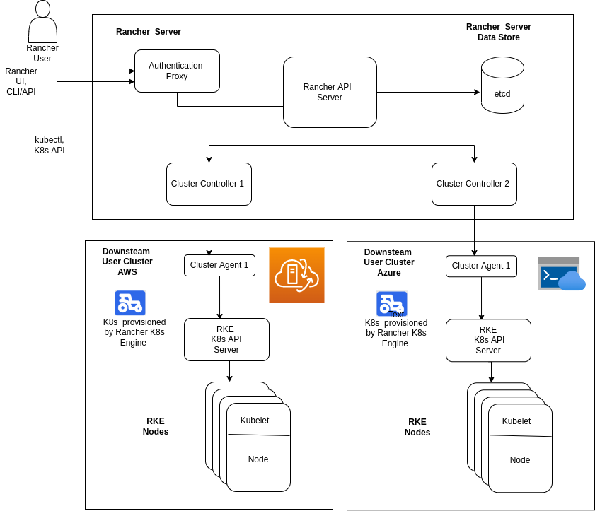

# Rancher
Rancher server is a K8s orchestration tool to manage multiple K8s cluster across any infrastructure i.e any cloud providers or bare-metal servers.
## Design 
* Architecture: Rancher server in IUDX is used to install K8s cluster and manage the Cluster across multiple clouds.
See architecture diagram below. 

Fig. 1: Rancher server Architecture

* Rancher can be installed in two ways
   1. Single Docker container: In this mode, rancher is brought up in a single docker container. It has no High availability and generally not prefferred production way to deploy to rancher. Please refer [here](docker-deployment/README.md) for more details
   2. Highly Available K8s cluster: Rancher is deployed on HA K8s cluster. In this setup Rancher is Highly Available and is recommended production deployment.  In our project we deploy Rancher on RKE2 K8s cluster. Please refer [here](HA-deployment/README.md) for more details

* Rancher supports following type of K8s cluster orchestration. 
   1. RKE K8s distribution on various cloud, bare metal 
   2. RKE2 K8s distribution on various cloud, bare metal 
   3. Import and manage cloud K8s as a service like GKE, AKS, and EKS
*  Please refer [here](../K8s/README.md) matrix against which type of K8s cluster and cloud provider IUDX is tested against

* Why Rancher is used to orchestrate (install, manage) K8s cluster and not managed K8s service?
   - The most important reason for using Rancher are as follows:
      - Easy orchestration (install, manage, delete) of multiple K8s cluster
      - Be able to deploy K8s cluster on any cloud through Open Source Software tool and be cloud agnostic. 

