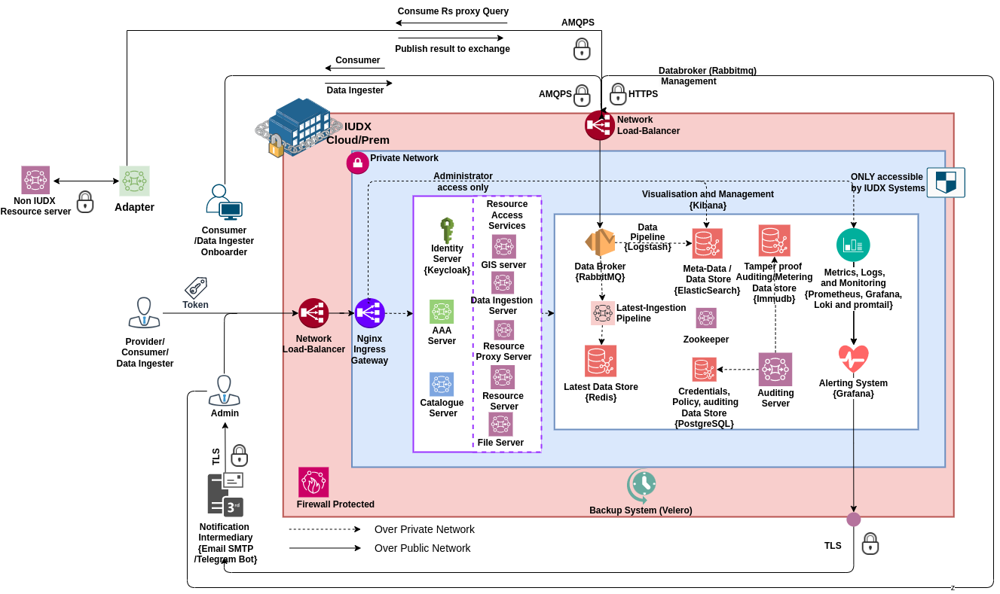

# K8s Based Deployment
IUDX platform can deployed in K8s using the scripts and K8s code present in this directory and sub-directories. Each component is deployed as clustered instance in K8s. The components automatically scale using Horizontal Pod Autoscaler (HPA) and nodes scale using Cluster Autoscaler (CA). IUDX platform exposes endpoints through two Network loadbalancer - one for HTTPS traffic which it passes to ingress controller and routes it to appropriate service; one for Rabbitmq management and AMQPS streaming. The whole system is monitored using monitoring stack module - prometheus for metrics, promtail and loki for logs and Grafana for visualisation and alerting.  We use velero as backup system.
The overall architecture of K8s deployment is summarised in below figure.  

## Features 
1. Highly avaibale and scalable IUDX platform
2. Cloud agnostic deployment, achieved through layered architecture of deployment and using open source tools whenever possible instead of using cloud services.
3. Production grade deployment of IUDX
4. Helm Chart based K8s deployment.

## Deployment 
IUDX deployment in K8s is based on layered architecture as depicted in below figure: 
Layered archtitecture gives more flexibility of replacing different technology/software in one layer and not affecting the whole deployment. It also enables to be cloud agnostic.

1. First layer is cloud infrastructure, this would inlcude bringing up necessary infrastructure for K8s deployment - VPC, subnet,Load balancers, IAM users, roles, Service Accounts, Virtual Machines, Security Groups.
2. Operating System: This can be any Linux based modern server distribution which is supported by Rancher. We typicall tes and support exclusively Ubuntu 20/22.04 LTS distrubition.
3. Container runtime: Typically, any container runtime supported by Rancher and specific K8s distrbution RKE1/RKE2 should work. We have tested against containerd runtime.
4. K8s Core cluster: This refers to K8s Cluster - control plane and worker node components. IUDX platform can be deployed on any CNCF certified K8s distribution. Its tested on RKE1 and RKE2 K8s distribution. The related deployment files to bring up Rancher (K8s cluster orchestrator) at [Rancher](./K8s-cluster/Rancher/README.md). To bring up K8s cluster using rancher at [RKE1](./K8s-cluster/K8s/RKE1/README.md) and [RKE2](./K8s-cluster/K8s/RKE2/README.md).
5. K8s addons - The components which are essential for certain features on top of K8s core cluster which IUDX K8s deployment will actively used but not part of IUDX platform are classified as K8s addons. This typically includes 
    1. CNI networking - Calico, Canal
    2. DNS - CoreDNS 
    3. Metrics Server
    4. Cluster Autoscaler - Rancher CA, AWS, Azure
    5. Ingress Controller - Nginx
    6. Storage
    7. Backup - Velero 
    8. Monitoring Stack
Typically, first three is deployed as part of K8s distribution for RKE1 and RKE2 based.
6. Workload/IUDX system: This is the actual deployment of IUDX components in K8s cluster. This is deployed through helm charts, present at directory [Charts](./Charts/).

The Deployment order follows in a layered way with the innermost layer deployed first and then the next layer , until the final layer of IUDX system. The IUDX system has lot of components and needs to be orderdly deployed, described in next sub-section

### Dependency in IUDX systems and ordering
IUDX components depend on each other and is represented below in Directed Acyclic Graph (DAG).

From DAG, the deployment can be ordered as follows in 6 stages:
1. Stage 1 
    1. Immudb
    2. Rabbitmq  
    3. Postgresql
    4. Redis
    5. Zookeeper
    6. Elasticsearch (Deploy ELK together)
2. Stage 2  
    1. Logstash
    2. Kibana
    3. Keycloak
    4. Latest ingestion pipeline
    5. Auditing server
3. Stage 3
    1. AAA server
4. Stage 4 
    1. Catalogue server
5. Stage 5 
    1. Resource Server
    2. Resource Server Proxy
    3. File server
    4. GIS server
    5. Data Ingestion server
6.  Stage 6
    1. Advance Monitoring Stack
