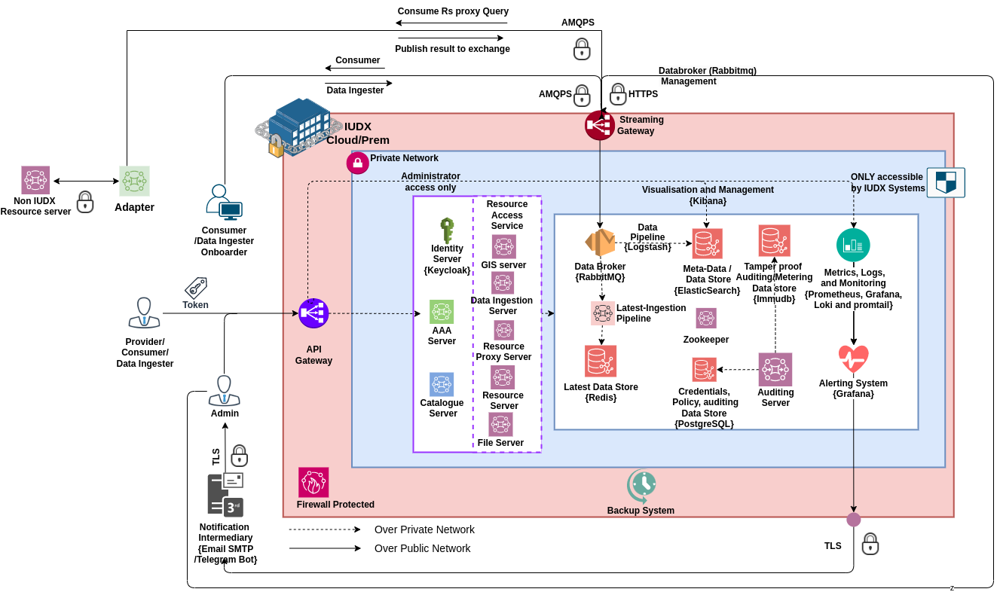

https://img.shields.io/jenkins/build?jobUrl=https%3A%2F%2Fjenkins.iudx.io%2Fview%2FKubescape%2Fjob%2Fkubescape%2F&label=kubescape

# iudx-deployment
Installation and setup scripts for single and multi node (clustered) IUDX services.

# Components

The IUDX system will consist of the following services and servers:
- API Server: Implements the Catalogue and Resource Server APIs (Vert.x HTTPs server)
- Database server: An IUDX Server
- Data broker Server: An IUDX Server
- Authentication and Authorization Server: An IUDX Server
- Database Service: Connects with the IUDX Database (A Vert.x Service)
- Databroker Service: Connects with the IUDX Data broker (A Vert.x Service)
- Subscription and Callback Service: Connects with the IUDX Database and Databroker (A Vert.x Service)
- Validation Service: Validates the catalogue item (A Vert.x Service)
- File Service: Connects with the IUDX Database, Databroker and File server (A Vert.x Service)
- Authentication and Authorization Service: Connects with the IUDX Authentication Server (Vert.x Service)

# Deployment Architecture

Note: For simplicity, all the modules are not mentioned in the figure. 

As a design choice on the architecture, keeping scalability for microservices in mind we chose the Service Mesh Architecture for Catalogue Server and Resource Server. In a service mesh architecture, each microservice is a well-defined module that can be containerized and discovered using service discovery. The orchestration of the services can be such that data-intensive modules are residing closer to the database which also helps in better response times, limits the bandwidth and reduces the cost. Also, it helps in scaling of a specific microservice at ease. 

# Features

- The system uses an overlay network and supports manual scaling using docker run.
- Hazlecase with Zookeeper is used as our cluster manager.
- Monitoring of the APIs, Services, Containers, Nodes are done using Micrometer, Promtail and Node exporter. 
- Metrics are pushed to Loki, Prometheus and visualized using Grafana.

## Contributing
We follow Git Merge based workflow
1. Fork this repo
2. Create a new feature branch in your fork. Multiple features must have a hyphen separated name, or refer to a milestone name as mentioned in Github -> Projects 
3. Commit to your fork and raise a Pull Request with upstream.  
A detailed instructions present [here](docs/git-commands.md).
